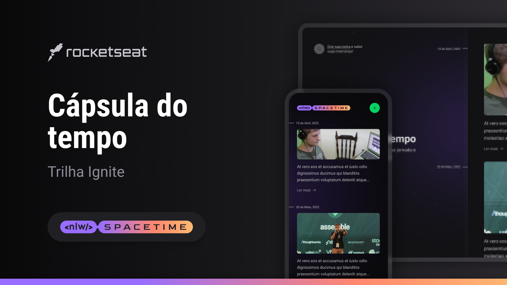

<h1 align="center">
  
</h1>

<h3 align="center">
  NLW Spacetime - Time Machine 🚀
</h3>

<p align="center">Store your memories and visualize through the passage of time and space.</p>

<p align="center">
  

  <a href="https://www.linkedin.com/in/matheralvs/" target="_blank" rel="noopener noreferrer">
    
  </a>
  
  <a href="https://github.com/matheralvs/nlw-spacetime/commits/main">
    
  </a>

  <a href="https://github.com/matheralvs/nlw-spacetime/issues">
    
  </a>
</p>

<p align="center">
  <a href="#-about-the-project">About the project</a> •
  <a href="#-technologies">Technologies</a> •
  <a href="#-getting-started">Getting started</a> •
  <a href="#-how-to-contribute">How to contribute</a>
</p>

## ✅ About the project

This project is a full-stack application, which will work as a time capsule storing past memories in a timeline. He was
used React, Tailwind, Node, Fastify, TypeScript, Expo, Next.js and much more!

## 🚀 Technologies

Technologies that I used to develop this api

- [ReactJS](https://pt-br.reactjs.org/)
- [ReactNative](https://reactnative.dev/)
- [NextJS](https://nextjs.org/docs)
- [Expo](https://pt-br.reactjs.org/)
- [TailwindCSS](https://tailwindcss.com/docs/installation)
- [NodeJS](https://nodejs.org/en)
- [Fastify](https://www.fastify.io/)

and others...

## 💻 Getting started

**Clone the project and access the folder**

```bash
$ git clone https://github.com/matheralvs/nlw-spacetime.git && cd nlw-spacetime
```

**Follow the steps below:**

### 🌐 Web
---

```bash
# Install the dependencies
$ npm i

# To finish, run
$ npm run dev

# Well done, project is started! Use .env.example to drive your environment variables
```

### 📱 Mobile
---

```bash
# Install the dependencies
$ npm i

# To finish, run
$ npm run start --clear

# Use Use ExpoGO or some emulator to start developing the application.
```

### 🖥 Server
---

```bash
# Install the dependencies
$ npm i

# To finish, run, for start api
$ npm run dev

# Well done, project is started! Use .env.example to drive your environment variables
```

## 🤔 How to contribute

**Make a fork of this repository**

```bash
# Fork using GitHub official command line
# If you don't have the GitHub CLI, use the web site to do that.

$ gh repo fork matheralvs/nlw-spacetime
```

**Follow the steps below**

```bash
# Clone your fork
$ git clone your-fork-url && cd nlw-spacetime

# Create a branch with your feature
$ git checkout -b my-feature

# Make the commit with your changes
$ git commit -m 'Feature: My new feature'

# Send the code to your remote branch
$ git push origin my-feature
```

After your pull request is merged, you can delete your branch.

Made with :purple_heart: by Matheus Alves 🤝 [See my linkedin](https://www.linkedin.com/in/matheralvs/)
